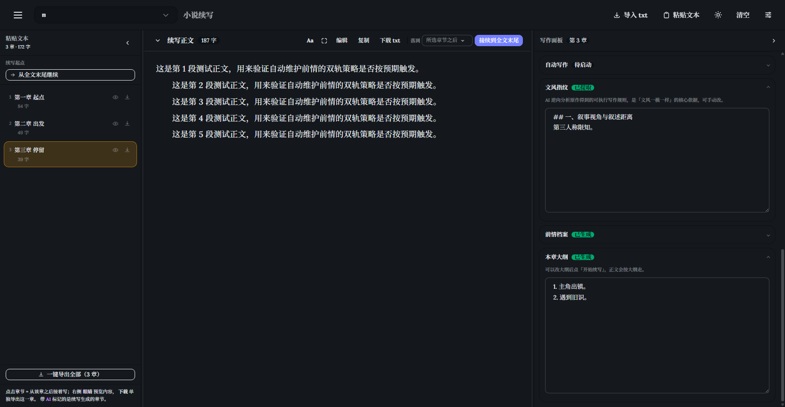

<div align="center">

# 小说续写工作台
**消耗token较多，注意！**
**把一整本小说丢进去，让 AI 顺着原作的文风、人物和伏笔继续往下写。**

单文件 · 零依赖 · 双击即用 · API Key 只留在你自己的浏览器里

> [!NOTE]
> 本仓库的全部代码、文本（含构建脚本与测试）**均由 AI 生成**，仅供学习与交流使用。

[](LICENSE)
[](#项目结构)
[](#它是怎么做到零依赖的)
[](#它是怎么做到零依赖的)
[](#贡献)

[在线试用](https://zhangjieyyds5.github.io/novel-continuation/) ·
[功能](#功能) ·
[快速开始](#快速开始) ·
[使用说明](#使用说明) ·
[它为什么不容易写崩](#它为什么不容易写崩) ·
[项目结构](#项目结构) ·
[自己构建](#自己构建) ·
[测试](#测试) ·
[常见问题](#常见问题)



</div>

---

## 这是什么

一个跑在浏览器里的**长篇小说续写工作台**。你把一部 txt 小说喂给它，它会读懂原作，然后按原作的调子往下写。

它不是"给个开头让 AI 自由发挥"那种玩具。它更像一个**带着档案写作的代笔**：

| 步骤 | 做什么 |
| :--- | :--- |
| 📖 **读原作** | 提取**文风指纹**（句式长短、人称、节奏、用词习惯）与**前情档案**（人物设定、关系、已知事实、未回收的伏笔） |
| 🧭 **定方向** | 先拟本章大纲，再由另一个调用**审校一遍**（查矛盾、查人物走样、查没推进） |
| ✍️ **动笔** | 用原作的文风锚点续写，篇幅给区间而不是死字数，让模型自己判断该写多长 |
| 🔍 **自检** | 写完对照前情档案做一致性检查，冲突处自动改掉 |
| 📚 **归档** | 落章进正文，并把新剧情并回前情档案 |

还支持**自动连写**：设好章数，剩下的它自己走完——出大纲、审校、写、自检、落章、维护前情，一条流水线跑到底。

**适用场景**：追的小说断更了想接着看、自己写到一半卡住了、想借原作的风格试写几章、给角色卡补剧情。

> **隐私说明**：API 地址和 Key 只写入你自己浏览器的 `localStorage`，不经过任何中间服务器，页面本身也不向第三方发请求。所有前端依赖（Vue / Tailwind / daisyUI）都已内联进单文件。

---

## 功能

- **导入即解析** — 自动按「第 N 章」切分，也可手动粘贴文本；支持选择从任意一章开始续写
- **文风指纹** — 从原作里提取可复用的写作风格描述，续写时当作硬约束
- **前情档案（双轨维护）** — 增量合并（旧档案 + 新章 → 新档案，便宜、不断线）+ 每 N 章从原文全量重建（消除累积误差、防止档案漂移）。两条轨道都能手动触发，界面上看得到「距下次全量重建还有几章」
- **本章大纲 + 大纲审校** — 出完大纲后由**独立调用**复核：事实矛盾 / 人物走样 / 时间线 / 重复桥段 / 有没有实质推进 / 铺垫是否到位 / 篇幅是否匹配，输出问题清单并给出优化稿，优化稿自动替换，原稿可一键还原
- **剧情罗盘** — 让前情维护顺手吐出一份结构化剧情状态：主线目标、当前阶段、最近推进、**已用过的场景**、**未回收的伏笔**、人物设定卡、下章必须推进什么、停滞风险自评。零额外调用成本，随后注入大纲 / 审校 / 正文三处当硬约束
- **停滞检测** — 模型自评 + 相邻章节 n-gram 重合率双路兜底，连续停滞时向下一章注入强制推进指令
- **剧情弧** — 连写多章时先排一次弧，给每章分配节拍（起 / 承 / 转 / 合）与必须交付的推进项，避免一章把结局提前写完
- **自动连写** — 预设章数与起始章，自动跑完整条流水线，可暂停 / 中断 / 看实时日志
- **一致性自检** — 写完自动比对档案，修正稿自动替换正文
- **三栏工作台** — 左（章节）/ 中（正文）/ 右（设置），栏宽可拖拽，双击复位；窄屏自动降级为抽屉；带专注模式
- **正文排版** — 字号、行距、字体（衬线 / 无衬线）、宽度调节，阅读体验对齐小说排版
- **章节预览与编辑** — 任意章节可预览、可改，改动会标记档案为「建议全量重建」
- **导出** — 一键导出成 txt
- **深色主题** — 跟随主应用主题，独立运行时自带切换
- **离线可用** — 断网也能打开界面（只是没法调模型）

---

## 快速开始

### 方式一：下载单文件（推荐）

1. 下载本仓库的 [`novel-continue-standalone.html`](novel-continue-standalone.html)
2. **双击打开**（Chrome / Edge / Firefox 均可，不需要装任何东西、不需要起服务器）
3. 首次打开会自动弹出「接口设置」，填三项：**API 地址** / **API Key** / **模型名**
4. 点「测试连接」确认能通，保存
5. 把小说 txt 拖进中间的虚线框

> 换了电脑或清了浏览器数据后需要重新填。设置只在本机。

### 方式二：在线版

打开 **https://zhangjieyyds5.github.io/novel-continuation/**

一样是纯前端页面，Key 依然只存在你自己浏览器的 `localStorage` 里 —— 这个线上版本和你本地那份**是同一个文件**。

### 你需要准备

**一个 OpenAI 兼容的接口**（`/v1/chat/completions`）。常见配置：

| 服务 | 接口地址 | 说明 |
| :--- | :--- | :--- |
| DeepSeek | `https://api.deepseek.com/v1` | 中文写作性价比高 |
| OpenAI | `https://api.openai.com/v1` | |
| 月之暗面 Kimi | `https://api.moonshot.cn/v1` | 长上下文友好 |
| 智谱 GLM | `https://open.bigmodel.cn/api/paas/v4` | |
| 本地 Ollama | `http://localhost:11434/v1` | Key 随便填 |
| 本地 LM Studio | `http://localhost:1234/v1` | Key 随便填 |
| 其他中转 | 任意兼容地址 | 填到 `/v1` 那一层 |

模型名填服务商的模型 ID（如 `deepseek-chat`、`gpt-4o-mini`）。工具支持配置**三档模型**并在顶栏切换，方便贵的用来写正文、便宜的用来跑归档。

**一部 txt 格式的小说**，章节标题形如 `第一章 xxx` / `第 1 章 xxx` / `Chapter 1`。没有章节标记也能用，会当作单章处理。

---

## 使用说明

### 第一次用，走这条最短路径

```
导入 txt  →  选续写起点  →  生成文风指纹  →  生成前情档案  →  开始续写
```

前三步各点一次按钮就行。**「生成前情档案」这一步别跳过** —— 后面的审校、自检、防跑偏全都依赖它。

### 手动续写

1. 在右栏「续写设置」里填**续写要求**（比如「让主角查清玉佩的来历，不要引入新角色」）
2. 设**篇幅区间**：`4 ~ 8 页`，每页按 500 字折算。这是个区间不是死数 —— 情节展开就往上限写，该收束就往下限收
3. 点「先出大纲」→ 看一遍，不满意可以直接改，或者点「审校大纲」让模型自己挑毛病
4. 点「开始续写」，正文会**流式**出现在中间栏
5. 满意就「落章」，它会插到你所选起点的后面

### 自动连写

右栏「自动写作」：

- **写几章** — 一次写多少章
- **每 N 章全量重建前情** — 默认 5。0 表示从不重建（省 token，但档案会慢慢漂）
- **每章先出大纲 / 审校大纲 / 自动自检** — 三个开关，按需关

点「开始」后跑的是这条流水线：

```
排剧情弧 → 大纲 → 审校 → 续写 → 一致性自检 → 落章 → 维护前情
```

跑到一半可以暂停，也可以中断。右栏会实时显示当前阶段和进度。

### 前情维护（右栏独立一节）

这是这个工具最核心的一节：

| 操作 | 什么时候用 |
| :--- | :--- |
| **增量合并** | 每次写完新章后。旧档案 + 新章 → 新档案，只花一次调用的钱，剧情不会断线 |
| **全量重建** | 档案开始"记得不准"了、或者你改了覆盖范围内的章节。重读原文重新归档，慢但干净 |
| **落章后自动增量合并** | 默认开。开了以后手动续写也会自动归档，不用记着点 |
| **每 N 章全量重建** | 默认 5。增量合并会累积误差，定期从原文重建一次把误差归零 |

界面上直接能看到：档案覆盖到第几章、还有几章待合并、距下次全量重建还有多远、下次会走哪条轨道。

---

## 它为什么不容易写崩

绝大多数"AI 续写"翻车在两个地方：**写到后面人物变了**、**剧情在原地打转**。这个工具用了五个机制叠加来对付它们。

### 1. 前情双轨维护

```
      增量合并（每章）                    全量重建（每 N 章）
   旧档案 + 新章 → 新档案              从原文重新归档
   ✅ 便宜，一次调用                   ❌ 贵
   ❌ 会累积误差                       ✅ 误差归零
```

只用增量 → 档案会慢慢漂移，几十章后人物就不对了。只用全量 → 每章都重读原文，token 烧得心疼。所以两条轨道都留着，按 `statePlan()` 统一决策：默认走增量，累计到阈值就自动切全量；档案被改动过、或覆盖范围失效，也会自动切全量。

### 2. 剧情罗盘（零额外调用）

前情维护那次调用会**顺手**输出一个结构化 JSON 块，包含：

```jsonc
{
  "主线目标": "...",
  "当前阶段": "...",
  "最近推进": ["...", "..."],       // 连续为空 = 停滞信号
  "已用场景": ["渡口夜谈", "..."],   // 禁止重复使用
  "未回收伏笔": ["...", "..."],      // 每章要回收至少一条
  "人物设定卡": { "沈砚": "..." },   // 不得违背
  "下章必须推进": "...",
  "停滞风险": "低"                   // 自我评估
}
```

它随后被注入到大纲、审校、正文三处。于是「别重复写过的场景」「这章至少回收一条伏笔」「人物设定不能违背」都从"建议"变成了硬约束。

### 3. 停滞检测

两路兜底，命中任意一条就算停滞：

- **模型自评** — 罗盘里的「停滞风险 = 高」，或「最近推进」为空
- **文本重合** — 纯前端算的相邻两章 6-gram 重合率 ≥ 20%（模型嘴上说在推进、实际在复读，它也能抓到）

连续停滞就向**下一章**注入强制推进指令：

> 让主角离开当前僵局，交代时间 / 地点 / 处境的变化，哪怕牺牲日常铺陈，也不许把同一场对峙换个说法再写一遍。

### 4. 剧情弧

连写 ≥3 章时先排一次弧，给每章分配节拍和必须交付的推进项。每章的大纲都会带上「第 k / N 章 · 本章只负责自己这一拍，不要提前把终点写完」。一次调用摊到 N 章上，成本几乎为零。

### 5. 提示词铁律

写正文的 system prompt 里写死了几条：

- 任何重大转折，前文必须有伏笔 / 动机 / 环境支撑；没有就在本章前半段补苗头，补不出来就推迟
- 每个人物的决定都要能从其性格和处境推出来，不许为了剧情需要强行降智
- 不许原地打转

---

## 项目结构

```
novel-continuation/
├── novel-continue-standalone.html   # ★ 成品：自包含单文件，双击即用
├── index.html                       # GitHub Pages 入口（跳转到上面那个）
├── docs/
│   └── screenshots/                 # 截图
├── tools/                           # 构建链（只有想改源码时才需要）
│   ├── build.mjs                    # 一键重建：抽取 → 内联 → 自检
│   ├── extract.mjs                  # 从上游页面抽取 + 植入独立运行能力
│   ├── offline.mjs                  # 内联 Vue / Tailwind / daisyUI
│   ├── inline-client.js             # 内联进去的轻量 API 客户端
│   ├── inline-setup.js              # 内联进去的独立版配置逻辑
│   ├── inline-modal.html            # 内联进去的「接口设置」弹窗
│   ├── publish.mjs                  # 发布到 GitHub（纯 REST，绕开被拦的 github.com）
│   └── vendor/                      # 被内联的三个前端依赖
└── tests/
    ├── standalone.test.mjs          # 独立版端到端（HTTP + file://）48 项
    ├── upstream.test.mjs            # 上游页面回归 76 项
    ├── syntax-check.mjs             # 语法与结构自检 45 项
    ├── mock-server.mjs              # Mock OpenAI 接口 + 静态服务
    └── screenshots.mjs              # 自动截图
```

### 它是怎么做到零依赖的

这个页面要的是**能双击就开**，所以：

- 原来从 CDN 拉的 Vue / Tailwind / daisyUI → **全部内联**进 HTML（`tools/vendor/`）
- Google Fonts → 去掉，改用系统字体栈
- 原来由宿主项目注入的 API 客户端 → 用约 200 行重写内联，实现**真流式** SSE（`reader.read()` 边读边回调，正文逐段出现）、错误分类（401 / 404 / 429 / 连不上 / 超时各说各的）、超时与主动中止区分
- 原来由宿主项目 `postMessage` 注入的接口配置 → 改成页面自己的设置弹窗 + `localStorage`

结果：**打开过程零外部请求**（这条有自动化断言，不是估的）。

---


## 常见问题

**Q：必须联网吗？**
打开界面不需要，`file://` 双击就能开。但调模型当然要能连上你填的接口。

**Q：Key 安全吗？**
只写在本机浏览器的 `localStorage` 里，不发送给除你填的那个接口之外的任何地方。这是个纯静态页面，没有后端。公用电脑上建议用完点「清除设置」。

**Q：为什么我填了接口还是报错？**
先点「测试连接」。常见原因：地址少填或多填了 `/v1`；Key 带了多余空格；接口不支持 CORS（浏览器直连会被拦，这种情况得走本地中转或换服务商）。

**Q：能处理多大的小说？**
导入不设上限，但传给模型时会截断。目前是取起点前的**最后 9 万字左右**做上下文，归档时取最后 3 万字。所以再长的书也能用，只是更早的细节要靠前情档案承载 —— 这也是为什么档案维护那一节很重要。

**Q：为什么续写出来的文风还是不太像？**
调高「续写设置」里的**贴合度**滑块（低更自由，高更贴原作），或者把「文风指纹」文本框里的描述改得更具体。指纹是模型总结的，你可以直接编辑。

**Q：能用于 RP / 角色扮演吗？**
可以。把角色卡内容当小说导入、或者直接填进「续写要求」，效果类似。

**Q：改了覆盖范围内的旧章节会怎样？**
档案会被标记为「建议全量重建」，但**仍然继续可用** —— 改个错别字不会让你白烧一次全量重建的 token。想彻底干净就点一下「全量重建」。

---

## 贡献

欢迎提 Issue 和 PR。比较想看到的方向：

- 更多前端依赖的瘦身（现在内联的 Tailwind 占了大头）
- 更好的篇幅控制（按字数 / 按场景数）
- 导出格式（EPUB、Markdown 分章）
- 更多接口兼容性验证

## 许可

[MIT](LICENSE)

> **关于代码来源**：本仓库全部代码 —— 包括页面本体、`tools/` 构建链与 `tests/` 测试 —— 均由 AI 生成，未经人工逐行审阅。逻辑与边界情况可能存在问题，请自行评估后再用于生产环境。

---

<div align="center">
<sub>这个仓库是从一个更大的写作工作台里抽出来的单页工具。抽出时的验证记录见 <a href="tests/">tests/</a>。</sub>
<sub>🤖 全部代码由 AI 生成 · 仅供学习交流</sub>
</div>
